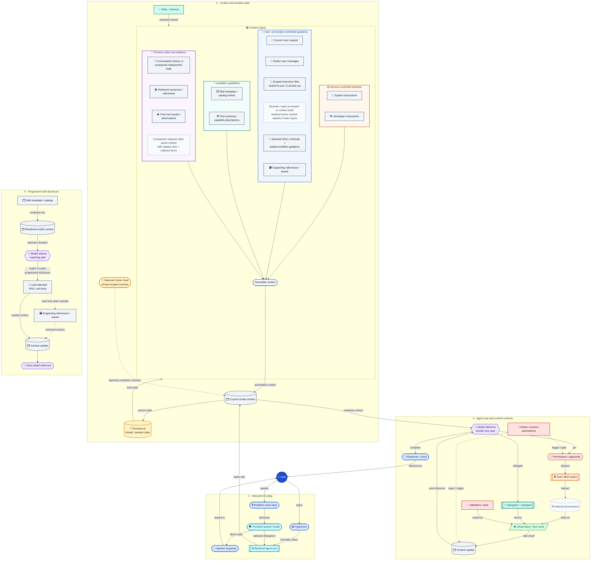

# ⚙️ Agent runtime model

Documentation snapshot: 2026-09-27. Re-verify provider-specific claims from their linked primary sources before relying on them as current behavior.

Use this reference to understand how context reaches a model, capabilities are selected, actions affect the environment, and state or events persist across turns. Start with the compact loop, then follow the document map to the narrowest relevant layer.

## 🗺️ Document map

| Need | Go to |
| --- | --- |
| Understand the basic agent loop and context lifecycle | [🔁 Runtime at a glance](#runtime-at-a-glance) |
| Compare instructions, skills, tools, hooks, permissions, and other mechanisms | [🧰 Mechanism taxonomy](#mechanism-taxonomy) |
| Understand conditions inside natural-language rules | [📝 Natural-language rules](#conditional-rules) |
| Choose the required enforcement strength | [🛡️ Reliability characteristics](#reliability) and the [`Agent engineering process`](agent-engineering-process.md) |
| Compare provider/harness concepts | [🌐 Provider and harness reality](#provider-reality) and the [`Provider path reference`](provider-paths.md) |
| Diagnose Codex instructions, skills, hooks, state, or freshness | [⌨️ Codex runtime mechanism map](#codex-runtime); for measured lifecycle evidence, use [`Codex configuration-freshness experiments`](codex-configuration-freshness-experiments.md) |
| Inspect context without flooding the model | [🔎 Context-efficient observation](#context-observation) |
| Analyze tokens, caching, allowances, or cost | [`Token usage and cost model`](token-usage-and-cost-model.md) |
| Diagnose desktop, web, text, voice, approvals, or result delivery | [`Interaction runtime model`](interaction-runtime-model.md) |
| Diagnose routing or control-surface selection | [`Interface, routing, and control design`](interface-routing-and-control.md) |

<a id="runtime-at-a-glance"></a>
## 🔁 Runtime at a glance

### 🧱 Runtime layers

An agentic system is not just an LLM. Model the runtime as a loop with distinct layers:

1. **Environment** — files, repositories, apps, APIs, clocks, calendars, issue trackers, browsers, operating system, and other external state.
2. **Harness / orchestrator** — the product or runtime that assembles context, exposes tools, manages permissions, runs the model loop, compacts history, and may persist sessions.
3. **Context assembly** — system/developer/user messages, conversation history, scoped instruction files, selected skill metadata or bodies, tool schemas, retrieved resources, and tool results.
4. **Model inference** — the LLM receives only the context made available for that turn and predicts a response and/or tool calls.
5. **Actuation** — tools, shell commands, MCP actions, file edits, browser actions, delegated agents, or other executable capabilities affect the environment.
6. **Observation** — results from those actions are returned to the harness and may be added to later model context.
7. **Persistence** — files, session state, memory systems, databases, git, or other stores preserve information beyond one inference call.
8. **Event / automation layer** — hooks, triggers, schedules, workflows, and external processes can run without relying on the model to spontaneously remember to act.


This loop aligns with the thought-action-observation trajectories described in Yao et al.'s [ReAct paper](https://arxiv.org/abs/2210.03629): model inference updates the working decision state, actions interact with an environment, and observations ground the next iteration. Here, “reasoning” means model inference and decision state; it does not imply that private chain-of-thought is exposed, human-readable, or persisted.

### 🗺️ Expanded runtime and mechanism map

The overview above is sufficient for most reasoning. Open the expanded map when you need product-surface routing, active-context assembly, durable state, or the mechanisms that inject, gate, execute, delegate, and validate work.

<details>
<summary>Show the full runtime and mechanism map</summary>



</details>

The diagram uses the general term **agent loop** from OpenAI's [long-horizon Codex explanation](https://developers.openai.com/blog/run-long-horizon-tasks-with-codex). In provider terms, Codex runs a turn within a durable thread, while Anthropic's [Claude Code CLI reference](https://docs.anthropic.com/en/docs/claude-code/cli-usage) uses **agentic turns** within a session. OpenAI's [Goals guide](https://developers.openai.com/cookbook/examples/codex/using_goals_in_codex) keeps a Goal separate as an optional thread-scoped completion contract across turns. The realtime-voice branch records one observed Codex macOS architecture, not a universal voice design. Whether a frontend speech model can access backend instructions such as `AGENTS.md` or `CLAUDE.md` must be verified separately for each voice implementation; the diagram does not assume that access.

<a id="context-lifecycle"></a>
### ♻️ Context lifecycle

Codex CLI enumerates applicable `AGENTS.md` files and injects each discovered chunk near the top of conversation history as a separate user-role message, before the user prompt, in root-to-leaf order. This describes discovery and injection, not a claim that the file is physically reread before every inference. Once retained in active history, the injected tokens can appear in every later rendered model input until context reconstruction, pruning, or compaction replaces them. See OpenAI's [Codex model guidance](https://developers.openai.com/api/docs/guides/latest-model?model=gpt-5.3-codex#using-agentsmd).

Skills use progressive disclosure. The initial model context contains compact metadata: name and description, plus the path for local Responses API skills. The model selects a matching skill from that metadata and then reads its full `SKILL.md`; supporting references, scripts, templates, and assets remain additional on-demand material. See the official [Skills API guide](https://developers.openai.com/api/docs/guides/tools-skills) and [plugin Skills concepts](https://developers.openai.com/plugins/concepts/skills).

Design for progressive disclosure: keep compact, broadly applicable invariants in `AGENTS.md`; put concise trigger conditions in skill metadata; keep detailed procedures in the selected `SKILL.md`; and load deeper references or assets only when the task needs them.

Stored rollout records, retained active items, and the context rendered for a model call are distinct runtime layers. Use [`Token Usage and Cost Model`](token-usage-and-cost-model.md) when the question concerns context-window consumption, token accounting, caching, allowances, credits, billing, or optimization.

The model cannot reason from information that never reaches its context, and it cannot perform an action for which the harness exposes no actuator.

<a id="mechanism-taxonomy"></a>
## 🧰 Mechanism taxonomy

Different mechanisms control different parts of the runtime.

| Runtime component / mechanism | Role | Entry point in lifecycle or context | Reliability profile | Deeper route |
| --- | --- | --- | --- | --- |
| Harness / orchestrator | Assembles context, exposes capabilities, runs the loop, and manages sessions | Before and throughout each turn | Product-controlled | [🌐 Provider and harness reality](#provider-reality) |
| Always-loaded instructions | Supply baseline model guidance | Context or session construction | Probabilistic; competes with other context | [📜 Hierarchical `AGENTS.md`](#hierarchical-agentsmd) |
| Skills / reusable playbooks | Supply conditional workflow knowledge | Model or user selects a skill | Probabilistic selection and execution | [📘 Skills and progressive disclosure](#skills-and-progressive-disclosure) |
| Retrieved references/resources | Supply on-demand facts or procedures | Explicit retrieval or skill step | Available only after retrieval | [♻️ Context lifecycle](#context-lifecycle) |
| Tool and MCP capability descriptions | Route the model toward an executable or retrievable capability | Tool selection during inference | Probabilistic routing | [🛠️ MCP and tools](#mcp-and-tools) |
| Tool implementation / scripts | Perform an action after selection | Tool invocation | Deterministic within code and environment limits | [🛠️ MCP and tools](#mcp-and-tools) |
| Hooks / event handlers | Inject context or run automatic checks and actions | Emitted runtime event | Deterministic if the event is emitted and the hook succeeds | [⚡ Hooks](#hooks) |
| Permissions / approvals | Allow, deny, or gate actions | Before a protected action | Strong enforcement | [🔐 Permissions and approvals](#permissions-and-approvals) |
| Validators / tests / linters | Detect invalid outputs or state | Explicit or event-driven execution | Deterministic for encoded conditions | [`Agent engineering process`](agent-engineering-process.md#behavior-validation) |
| Scheduler / automation | Run work at a time or external event | Clock, schedule, or external event | Independent of a fresh user prompt | [🧱 Runtime layers](#runtime-at-a-glance) |
| Memory / persistent files | Preserve state beyond one inference or session | Explicit read/write policy | Persistence only; use still depends on loading | [💾 Sessions, compaction, goals, and persistent state](#sessions-compaction-goals-and-persistent-state) |
| Subagents / delegation | Isolate or parallelize task context | Harness or model delegation | Same sensor and actuator limits apply per worker | [🤝 Subagents](#subagents) |
| UI / human confirmation | Obtain missing judgment or authorization | Interaction point | Human-controlled decision surface | [`Interaction runtime model`](interaction-runtime-model.md) |

Stronger wording does not change the underlying mechanism. `Always`, `never`, `critical`, repetition, and all-caps remain prompt-level guidance unless a separate control surface enforces the behavior.

<a id="conditional-rules"></a>
## 📝 Natural-language rules are conditional programs

A Markdown instruction file can contain conditional rules even after the file itself has been loaded. Such a rule has two logical parts:

1. **Condition / trigger** — the observable situation in which the rule applies.
2. **Behavior / action** — what the agent should do once that condition is satisfied.

The condition can only affect runtime behavior when the model has evidence from which it can determine that the condition applies. If that evidence is absent, the rule may be present in context but remain inapplicable or impossible to evaluate.

This is distinct from skill-level progressive disclosure. Skill metadata can determine whether a skill body becomes available at all; once the body is loaded, individual rules inside it can still have their own conditions. Loading the body makes a rule available to the model, but does not mean its condition is satisfied. A rule such as "when you are tired, do X" therefore depends on whether the runtime supplies evidence from which "tired" can be inferred.

Because condition and consequence are separate logical roles, instruction text can represent them explicitly rather than embedding both in one prose sentence. For example, Markdown may use visibly separated **When** and **Then** blocks, a two-column condition/action table, or another structure that preserves the same distinction. This formatting does not create a new runtime mechanism; it makes the rule's applicability and consequence easier to distinguish within the context already loaded.

<a id="reliability"></a>
## 🛡️ Reliability characteristics

Mechanisms provide different levels of enforcement:

1. Passive prose in a prompt or instruction file.
2. Conditionally retrieved skill/reference.
3. Explicit model classification with the required evidence in context.
4. Tool-assisted check using live external state.
5. Deterministic validator or script invoked by the workflow.
6. Event hook or permission gate that runs by construction.
7. External automation or system policy independent of model initiative.

The sequence generally moves from probabilistic guidance toward stronger enforcement, while implementation cost and platform coupling also tend to increase.

<a id="provider-reality"></a>
## 🌐 Provider and harness reality

Agent harnesses do not have feature parity. The same conceptual mechanism can be exposed through different concrete surfaces, or may be absent on a given runtime.

### OpenAI / Codex

- Codex-style `AGENTS.md` files are scoped instructions assembled from the filesystem hierarchy and injected into model context.
- Agent Skills expose name/description metadata before selection; the full `SKILL.md` and supporting files are loaded after the skill is selected.
- Plugins can package skills and lifecycle hooks; exact availability still depends on the execution surface.
- OpenAI's Agents API uses a managed Codex harness that owns orchestration, context compaction, and durable sessions while the application supplies tools and execution environment.

### Claude Code

- Claude Code distinguishes `CLAUDE.md`/rules, skills, subagents, hooks, output styles, and system-prompt additions by when they enter context and how they persist.
- Hooks are event-driven commands and can run at lifecycle points such as session/prompt/tool events; their execution is tied to emitted runtime events rather than model initiative.
- Skills and subagents are not equivalent to hooks: they guide or delegate model work rather than deterministically firing on every matching runtime event.

For exact current filesystem conventions, use the [`Provider path reference`](provider-paths.md) instead of expanding this conceptual comparison with path details.

<a id="codex-runtime"></a>
## ⌨️ Codex runtime mechanism map

These are distinct control surfaces with different loading, triggering, and enforcement behavior.

<a id="hierarchical-agentsmd"></a>
### 📜 Hierarchical `AGENTS.md`

Codex loads global guidance from `$CODEX_HOME/AGENTS.md` (normally `~/.codex/AGENTS.md`). It then discovers project guidance from the identified project root down to the current working directory. The default project-root marker is `.git`; when no configured project marker is found, Codex checks only the current working directory for project guidance. An `AGENTS.md` in a non-Git parent is therefore not inherited merely because it is an ancestor.

The resulting instruction chunks are injected before the current user prompt in root-to-leaf order; deeper scopes can override earlier guidance. `AGENTS.override.md` can replace the normal file at a scope. Treat the configured `project_root_markers` list as live configuration rather than assuming `.git` when diagnosing a specific installation.

<a id="skills-and-progressive-disclosure"></a>
### 📘 Skills and progressive disclosure

Skill discovery is staged:

1. Codex initially sees skill metadata, especially `name` and `description`.
2. When a skill is selected, its `SKILL.md` instructions become available.
3. `references/`, `scripts/`, and `assets/` are consumed only when the workflow needs them.

The metadata catalog is therefore a pre-selection routing surface, while the body and supporting resources are post-selection execution surfaces. A behavior that must shape every response belongs in always-loaded guidance or a stronger lifecycle/enforcement mechanism, not only in a conditional skill.

<a id="hooks"></a>
### ⚡ Hooks

Codex currently documents command hooks for lifecycle events including `SessionStart`, `UserPromptSubmit`, `PreToolUse`, `PermissionRequest`, `PostToolUse`, `PreCompact`, `PostCompact`, `SubagentStart`, `SubagentStop`, `Stop`, `Interrupt`, and `SessionEnd`.

Hooks can inspect structured runtime input. Depending on the event, they can inject context, block a prompt or tool call, rewrite tool input, emit warnings, or run post-action checks. `PostToolUse` cannot undo an action that already happened.

Current Codex command hooks are not a generic arbitrary-agent callback system. OpenAI documents `prompt` and `agent` hook handlers as parsed but skipped, so only the supported command-hook events and effects are active runtime mechanisms.

<a id="mcp-and-tools"></a>
### 🛠️ MCP and tools

MCP is a protocol boundary for runtime extensions, not a provider, harness, or agent by itself. Servers can expose resources, prompts, and tools; clients decide how those capabilities enter the model context and user experience. An MCP server can expose live information and controlled actions, but it does not itself guarantee that the model will select a capability. Tool descriptions and schemas are model-visible selection surfaces, while server-side code determines what happens after invocation.

The 2026-07-28 MCP specification uses a stateless protocol core. Cross-call server state therefore requires an explicit state mechanism such as handles or application-managed persistence rather than implicit transport session state.

### 🧩 Plugins

A plugin is a packaging and distribution boundary. OpenAI plugins can bundle skills, MCP configuration, assets, and Codex lifecycle hooks. Plugins do not by themselves make a capability deterministic: reliability still depends on the contained mechanism and the surface where it runs.

<a id="permissions-and-approvals"></a>
### 🔐 Permissions and approvals

Permissions and approval policies are enforcement surfaces that can determine whether an action may proceed. Hooks are a separate event-driven surface that can perform checks before or after supported tool calls.

<a id="sessions-compaction-goals-and-persistent-state"></a>
### 💾 Sessions, compaction, goals, and persistent state

Conversation state, global instructions, and memory are separate forms of state. In OpenAI's managed Codex harness, a session is a durable unit of work.

"Context usage" means the currently rendered model input, not the visible chat length or the entire persisted transcript. OpenAI's [compaction guide](https://developers.openai.com/api/docs/guides/compaction) documents that crossing a configured threshold can emit an encrypted, opaque compaction item, prune older active context, and carry forward key prior state and reasoning in fewer tokens. A compacted window can also retain selected earlier items. The full local rollout may remain persisted even though those records are no longer all rendered into the next inference.

**Version-specific local observation (Codex 0.149.0):** one inspected rollout stored a `type: compacted` record with `replacement_history`; the replacement retained explicit messages plus an encrypted compaction item. These field names describe that version and rollout, not a stable public schema. The measured token change and its diagnostic projection live in the [`Token usage and cost model`](token-usage-and-cost-model.md#rollout-observations).

To inspect another rollout safely, choose one explicit rollout JSONL file and return only the compacted-record projection instead of searching the whole rollout tree:

```bash
ROLLOUT_FILE=/absolute/path/to/one/rollout.jsonl
jq -c 'select(.payload.type == "compacted") | .payload | {type, replacement_history_count: (.replacement_history | length)}' "$ROLLOUT_FILE" | head -n 3
```

Rollout files can contain prompts, tool output, and other sensitive context. Keep inspection local, target a known file, and project only the fields needed for the diagnosis. Field names and record shapes may change between Codex versions. Use the [`Token usage and cost model`](token-usage-and-cost-model.md#diagnostic-sequence) for usage and cache projections.

Codex Goals are thread-scoped persisted state rather than global memory or project instructions. Thread/session state belongs to one ongoing trajectory, while files or another explicit store can persist state beyond that scope.

<a id="session-freshness"></a>
### 🔄 Session and configuration freshness

A running conversation or agent session has its own assembled context and runtime state. Changes to external configuration surfaces such as instruction files, skills, MCP configuration, hooks, or generated installations do not imply that every already-running session has incorporated those changes. Freshness behavior is harness-specific.

Therefore, the existence of an updated file on disk and the presence of that update in a particular session's effective context are separate facts. A new session commonly rebuilds configuration/context from current sources; an existing session may require an explicit refresh, reload, re-read, session update, or restart depending on the harness. Do not assume automatic propagation without a documented mechanism or direct verification.

Controlled evidence shows why the lifecycle boundary matters: successive Codex CLI `exec resume` processes refreshed skill metadata and project instructions in the tested CLI version, whereas one continuously open desktop chat retained its original skill catalog while rereading an explicitly selected skill body from disk. These are bounded observations, not universal hot-reload guarantees. Use the [`Codex configuration-freshness experiments`](codex-configuration-freshness-experiments.md) for the full setup, evidence, limitations, cross-surface comparison, and reproduction procedure.

<a id="subagents"></a>
### 🤝 Subagents

Subagents are separate model workers started by the harness for delegated work. They may have isolated task context and their own lifecycle events, but they remain bounded by what context, tools, permissions, and environment the harness gives them.

Delegation changes task decomposition and context isolation; it does not by itself create an enforcement mechanism.

<a id="context-observation"></a>
## 🔎 Context-efficient observation

Local computation is not itself model context. Only the command or tool result returned to the model consumes the active context window. Parse large artifacts locally and return a compact projection: bound matches, select relevant fields, cap lines, and summarize counts.

Avoid broad recursive `rg`, web search, resource-listing, or rollout-log queries when a narrower target will answer the question. In particular, self-referential searches over rollout history can reproduce earlier prompts and nested tool outputs, injecting thousands of duplicate tokens into the very context being diagnosed.
