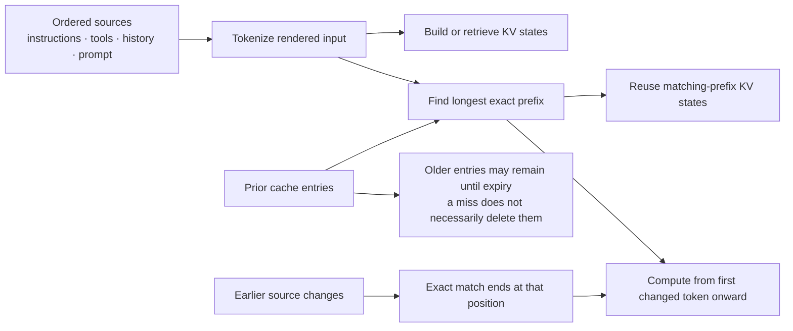

# Token Usage and Cost Model

Use this reference to analyze context-window consumption, token usage, prompt-cache behavior, API cost, or ChatGPT/Codex allowance and credit accounting. Do not infer any of them from stored rollout-record counts alone.

## Five diagnostic layers

| Layer | What it establishes |
| --- | --- |
| Stored rollout or transcript records | Append-only persistence and diagnostic evidence. A block can be stored once yet participate in many later model calls. |
| Active conversation/context items | Items retained after pruning, reconstruction, or compaction and available to build the next request. |
| Rendered input for one inference | The complete input supplied to one model call, including retained items and harness-provided surfaces that may not recur as transcript messages. |
| Usage accounting | Per-inference `input_tokens`, `cached_tokens`, output tokens, and reasoning tokens. These fields support conclusions about processed usage and aggregate cache reuse. |
| Product accounting | The applicable API price, ChatGPT/Codex subscription allowance, credit balance, workspace rate card, or other product-specific accounting surface. |

Never infer token cost, context-window occupancy, repeated model exposure, cache treatment, or instruction robustness merely from how many times a block appears in stored logs. Repeated skill-catalog or runtime records can reflect reinjection or updates without proving full-price processing on every occurrence or stronger instruction following.

## What reaches rendered input

Codex CLI enumerates applicable `AGENTS.md` files and injects each discovered chunk near the top of conversation history as a separate user-role message, before the user prompt, in root-to-leaf order. This describes discovery and injection, not physical rereading before every inference. Once retained in active history, one stored instruction block can appear in many later rendered inputs. See OpenAI's [Codex model guidance](https://developers.openai.com/api/docs/guides/latest-model?model=gpt-5.3-codex#using-agentsmd).

Skills use progressive disclosure. Initial context contains compact metadata: name and description, plus the path for local Responses API skills. The model selects from that metadata, then reads the chosen `SKILL.md`; supporting references, scripts, templates, and assets remain on-demand. See the [Skills API guide](https://developers.openai.com/api/docs/guides/tools-skills) and [plugin Skills concepts](https://developers.openai.com/plugins/concepts/skills).

Tool descriptions can arrive through request tool definitions rather than repeated transcript messages. OpenAI's [function-calling token-usage guidance](https://developers.openai.com/api/docs/guides/function-calling#token-usage) states that callable definitions count against the context limit and as input tokens. The [token-counting guide](https://developers.openai.com/api/docs/guides/token-counting) likewise includes tool definitions and request-structure formatting in the exact input count.

## Repeated input and prompt caching

Without caching, a stable block of `L` tokens retained across `N` model calls contributes approximately:

`L × N` input tokens

Prompt caching reuses computation for an unchanged prefix. Cached tokens remain input tokens, occupy context-window space, and count toward rate limits; a cache hit reduces latency and the applicable input rate rather than removing those tokens from the request.



The cache operates on the fully rendered, tokenized request, not on source-file identity. Sources are ordered before tokenization; the reusable portion is the longest exact prefix available under the provider's routing rules. A change near the beginning can therefore end reuse for everything after that position even when later text is unchanged. The nonmatching older entry is not necessarily deleted: it can remain eligible until eviction or expiry and may be reused by a later request that matches it again. See [Prompt caching](https://developers.openai.com/api/docs/guides/prompt-caching) and [prompt-cache diagnostics](https://developers.openai.com/api/docs/guides/prompt-caching/diagnostics).

With one full-price processing followed by cached reads at multiplier `r`, a simplified price-equivalent is:

`L + (N − 1) × r × L`

Every call still occupies `L` context-window tokens. When a model uses a distinct cache-write multiplier `w`, replace the first `L` with `w × L`. As a verified snapshot on 2026-09-27, the GPT-5.6+ API documentation lists reads at `0.1×` and writes at `1.25×` the standard uncached input-token rate. These are time-bound API mechanics, not a confirmed formula for the Codex allowance included with a ChatGPT subscription. See [Prompt caching](https://developers.openai.com/api/docs/guides/prompt-caching).

> **Live-verification rule:** Before making a cost decision, verify the current factors and their model/API applicability in the official OpenAI prompt-caching and pricing documentation. Rates, supported models, and cache behavior can change; never promote this dated snapshot into a timeless constant or a ChatGPT/Codex subscription formula.

## Compaction

Compaction replaces older active history with a smaller opaque compaction item plus retained items. This can reduce later rendered inputs while changing the prompt prefix enough to reduce cache reuse immediately afterward. Treat the returned compacted window as the canonical next context rather than inferring its contents from older stored records. See [Compaction](https://developers.openai.com/api/docs/guides/compaction).

## Product accounting

API token prices, ChatGPT plan allowances, Codex credits, workspace rate cards, and internal product meters are separate accounting surfaces. Signing into Codex with ChatGPT uses the applicable ChatGPT plan's usage and billing, while using an API key uses API pricing. Check the live account surface before concluding cost or remaining capacity:

- [Using Codex with your ChatGPT plan](https://help.openai.com/en/articles/11369540-using-codex-with-your-chatgpt-plan)
- [Using credits for flexible usage](https://help.openai.com/en/articles/12642688-using-credits-for-flexible-usage-in-chatgpt-personal-plans)
- [ChatGPT Work and Codex](https://help.openai.com/en/articles/20001275-chatgpt-work-and-codex)

## Practical diagnostic sequence

Use one explicit rollout and avoid recursively dumping full logs:

1. Count stored records by category without returning their full bodies.
2. Identify the active replacement state after any compaction.
3. Inspect per-inference token snapshots instead of treating transcript records as model calls.
4. Use `input_tokens`, `cached_tokens`, output-token, and reasoning-token fields to characterize usage.
5. Consult the applicable ChatGPT/Codex allowance, credit, workspace rate card, or API pricing view before concluding monetary or quota cost.

## Local rollout observation

The following evidence is version- and session-specific, not a universal ratio:

| Observation | Measured value |
| --- | ---: |
| Explicit `AGENTS.md` records | 1 |
| Additional analyzer-classified skill-catalog/runtime blocks | 5 |
| Token-count snapshots | 290 |
| Explicit `AGENTS.md` size | Approximately 19,812 characters / 4,953 estimated tokens |
| Five additional blocks | Approximately 112,454 characters / 28,113 estimated tokens |
| Latest exact inference input | 158,680 tokens |
| Reported cached input in that inference | 158,208 tokens |
| Remaining non-cached input | 472 tokens |

Record count and model-call snapshot count clearly differ. The aggregate cache report does not attribute cached tokens to individual blocks, so it cannot establish per-block cache treatment or cost.

### Configuration-refresh cache observation

A separate controlled Codex CLI `0.149.0` resume experiment changed a temporary project skill and `AGENTS.md` while retaining one thread. These are first-inference snapshots for the relevant turns; tool-reading turns could contain an additional inference and are excluded from this comparison.

| Resumed turn | Input tokens | Cached input tokens | Non-cached input tokens |
| --- | ---: | ---: | ---: |
| Initial baseline | 21,916 | 11,264 | 10,652 |
| After matching skill-description change | 27,151 | 21,760 | 5,391 |
| Repeated unchanged skill-description variant | 27,460 | 27,264 | 196 |
| After skill-body change; metadata unchanged | 27,758 | 27,520 | 238 |
| After `AGENTS.md` marker change | 32,376 | 28,032 | 4,344 |
| Repeated unchanged `AGENTS.md` variant | 32,476 | 32,256 | 220 |

The rollout proves aggregate prefix reuse, not token-level attribution to a particular source block. The lower cached share immediately after each early injected-surface change, followed by a much higher share on the unchanged repeat, is consistent with exact-prefix invalidation and later reuse. It is not proof that the changed file alone caused every non-cached token: conversation growth, catalog reinjection, tools, and other rendered-request differences also changed. The unchanged skill-body edit retained high first-inference reuse because the body was loaded later through a tool call rather than changed in the initial metadata prefix.

### Continuously open desktop cache observation

A separate controlled Codex desktop experiment kept one chat and one app process open while changing a project-local skill. The tested app was version `26.924.20706` (build `11431`) with Codex CLI `0.149.0`; refresh those values using the commands in the [desktop lifecycle experiment](agent-runtime-model.md#controlled-codex-desktop-experiment). The rollout reported `cache_write_input_tokens: 0` for every recorded inference.

| Desktop inference | Input tokens | Cached input tokens | Non-cached input tokens |
| --- | ---: | ---: | ---: |
| Initial setup turn | 38,560 | 21,248 | 17,312 |
| Baseline with original nonmatching catalog entry | 45,053 | 38,400 | 6,653 |
| After on-disk description change; catalog remained stale | 45,215 | 44,928 | 287 |
| Unchanged repeat of the stale-catalog variant | 45,380 | 45,056 | 324 |
| Skill-body `V2` invocation, before file read | 45,496 | 45,184 | 312 |
| Skill-body `V2` invocation, after file read | 45,704 | 45,312 | 392 |
| Project-instruction no-read probe | 45,922 | 45,568 | 354 |
| Unchanged `V2` invocation, before file read | 46,100 | 45,696 | 404 |
| Unchanged `V2` invocation, after file read | 46,308 | 45,952 | 356 |

These counts show high aggregate prefix reuse after the initial turns. The on-disk metadata edit did not produce the cache reduction seen after the CLI resume metadata refresh because the desktop rollout did not inject the changed catalog entry. The body edit also left the initial prompt prefix highly reusable; the new body arrived later as tool output. This is consistent with exact-prefix caching, but it does not attribute any individual cached token to a particular instruction, catalog entry, or file.

To reproduce the projection for one explicit rollout without printing the full JSONL:

```bash
jq -c '
  select(.type == "token_usage_record")
  | {
      turn: .payload.turn_id,
      input: .payload.usage.input_tokens,
      cached: .payload.usage.cached_input_tokens,
      cache_write: .payload.usage.cache_write_input_tokens,
      output: .payload.usage.output_tokens
    }
' /absolute/path/to/the/desktop-rollout.jsonl
```

Treat the field names, counts, and ratios as version- and session-specific rollout evidence, not a stable desktop API or a billing statement. Official OpenAI documentation likewise says session continuity does not guarantee a cache hit and that recorded usage is best-effort.

## Optimization principles

- Keep compact, broadly applicable invariants in `AGENTS.md`.
- Put concise trigger conditions in skill metadata.
- Keep detailed procedures in selected skill bodies.
- Load deeper references and assets only when needed.
- Keep tool descriptions concise and defer rarely used tools when the runtime supports tool search.
- Preserve stable prefixes when cache reuse matters, but evaluate compaction by total rendered input and task quality rather than cache-hit rate alone.
